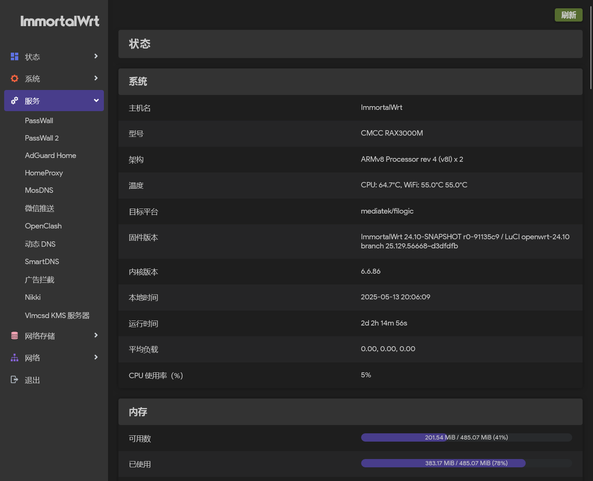
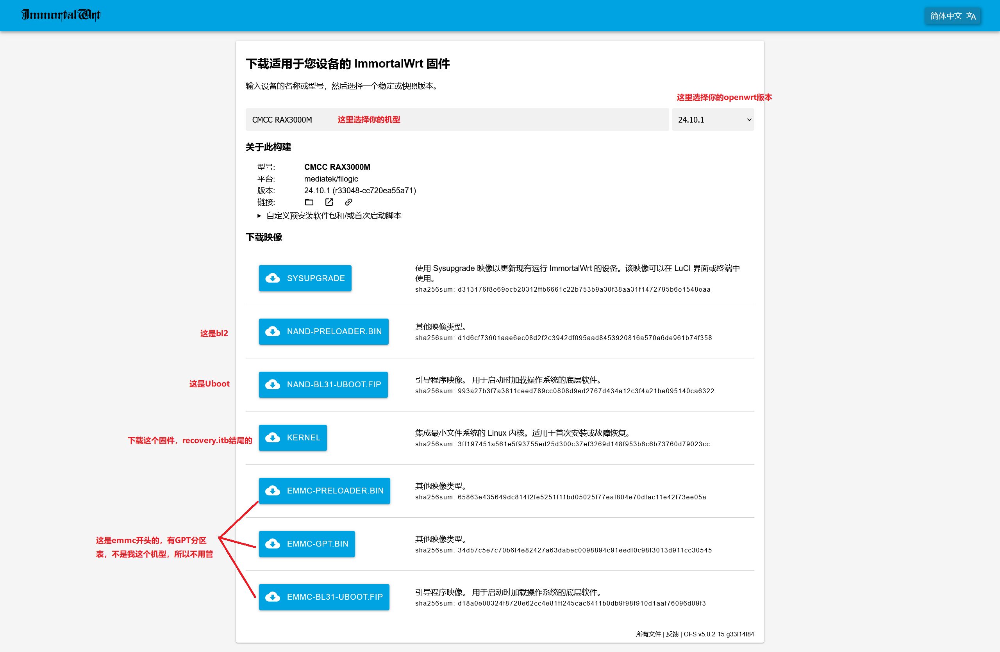

## ip地址：192.168.8.1 
默认开启smartdns解析，本地端口1053，外地端口6553（可以自己看看里面的解析服务器） 
 

## 如何使用呢？ 

**X86** 平台：应该不用教了吧，写在U盘也行，硬盘也行。 

**Allwinner、Rockchip** 平台：能插内存卡的可以写内存卡，emmc的就自己找官方工具写入 

**mt7621** 应该也不难，先刷好不死然后刷 -factory.bin 后面再刷 -squashfs-sysupgrade.bin 就可以 

**MTK-filogic** 平台最麻烦 
先科普一下 
**-gpt.bin** 有些存储空间比较大的机型会有这个文件，不多（*有的话第一次也要刷* ） 
**-preloader.bin** 是 **bl2** （op官方需要..所以第一次刷必须！） 
**-bl31-uboot.fip** 是 **uboot** （不刷你也刷不了这个固件！）*后续想刷回lede的固件可以用ttl先把这个刷了，Uboot就改它需要的文件名..就是 -fip-expand.bin 文件改 .fip文件..* 
**-recovery.itb** 这是uboot自动识别刷入的 第一个初始固件（这里推荐使用天灵大佬的初始固件，下面网址），刷了以后开机进去的时候会提示让你刷 -squashfs-sysupgrade.itb 结尾的固件（这个就可以刷本仓库编译出来带 squashfs 的固件） 

[ImortalWrt Firmware Selector](https://firmware-selector.immortalwrt.org/)
这是天灵大佬的自动生成固件网站 

例如我的设备CMCC RAX3000M nand版本

如果你本来是有192.168.1.1后台的uboot了（能刷lede固件的）如何切换到这个固件呢？ 
192.168.1.1/uboot.html 
192.168.1.1/bl2.html 
根据上面提示自己领悟..完毕。 
 
**English** | [中文](https://p3terx.com/archives/build-openwrt-with-github-actions.html)

# Actions-OpenWrt

A template for building OpenWrt with GitHub Actions

## Usage

- Click the [Use this template](https://github.com/P3TERX/Actions-OpenWrt/generate) button to create a new repository.
- Generate `.config` files using [Lean's OpenWrt](https://github.com/coolsnowwolf/lede) source code. ( You can change it through environment variables in the workflow file. )
- Push `.config` file to the GitHub repository.
- Select `Build OpenWrt` on the Actions page.
- Click the `Run workflow` button.
- When the build is complete, click the `Artifacts` button in the upper right corner of the Actions page to download the binaries.

## Tips

- It may take a long time to create a `.config` file and build the OpenWrt firmware. Thus, before create repository to build your own firmware, you may check out if others have already built it which meet your needs by simply [search `Actions-Openwrt` in GitHub](https://github.com/search?q=Actions-openwrt).
- Add some meta info of your built firmware (such as firmware architecture and installed packages) to your repository introduction, this will save others' time.

## Credits

- [Microsoft Azure](https://azure.microsoft.com)
- [GitHub Actions](https://github.com/features/actions)
- [OpenWrt](https://github.com/openwrt/openwrt)
- [Lean's OpenWrt](https://github.com/coolsnowwolf/lede)
- [tmate](https://github.com/tmate-io/tmate)
- [mxschmitt/action-tmate](https://github.com/mxschmitt/action-tmate)
- [csexton/debugger-action](https://github.com/csexton/debugger-action)
- [Cowtransfer](https://cowtransfer.com)
- [WeTransfer](https://wetransfer.com/)
- [Mikubill/transfer](https://github.com/Mikubill/transfer)
- [softprops/action-gh-release](https://github.com/softprops/action-gh-release)
- [ActionsRML/delete-workflow-runs](https://github.com/ActionsRML/delete-workflow-runs)
- [dev-drprasad/delete-older-releases](https://github.com/dev-drprasad/delete-older-releases)
- [peter-evans/repository-dispatch](https://github.com/peter-evans/repository-dispatch)

## License

[MIT](https://github.com/P3TERX/Actions-OpenWrt/blob/main/LICENSE) © [**P3TERX**](https://p3terx.com)
